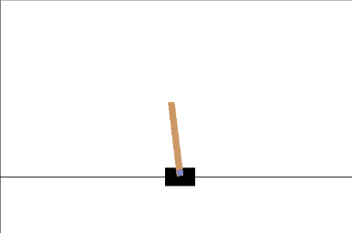

# RL_PoleCartControl
Controlling an inverted pendulum using reinforcement learning

## OpenAI Gymnasium environment
For this project I used OpenAI's gymlibrary at https://www.gymlibrary.dev/environments/classic_control/cart_pole/

The cart is attached to an un-actuated joint on the cart, that moves along a frictionless surface. The goal is to balance the pendulum by moving the cart left or right.




## TensorFlow and Keras
The program utilises TensorFlow 2.3.0 (Sorry Windows peeps) and both Keras and keras-rl2
```bash
pip install tensorflow==2.3.0 keras keras-rl2 gym
```
This also run in a python evironment using Python3.11
```bash
py -3.11 -m venv tf_env
tf_env\Scripts\activate
pip install tensorflow
```